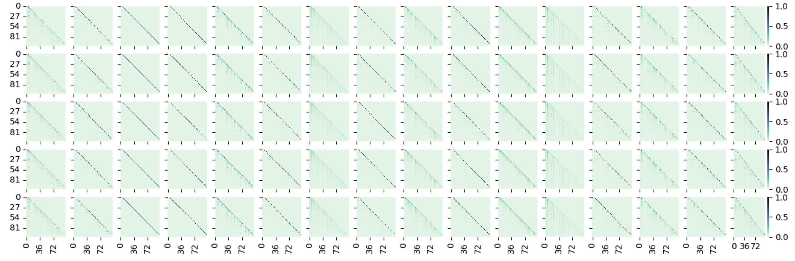

# Attention Interpolation Probe
[[Substack]](https://ovshake.substack.com/p/style-transfer-using-prompt-embeddings)

A weekend exploration of how language models handle interpolated prompts in embedding space.

## Overview
This project investigates how transformer attention patterns change when prompts are linearly interpolated between two different questions. For example, what happens to model responses when we smoothly transition from "What is 2+2?" to "What is 10/2?" in embedding space?

## Key Findings
- Generated responses show interesting transitions between source and target prompts
- Model behavior varies significantly based on interpolation coefficient (alpha)
- Results suggest non-linear relationships between prompt embeddings and model outputs

## Implementation
- Uses simple linear interpolation between prompt embeddings
- Tests multiple prompt pairs (math problems, factual questions, language translation)
- Analyzes responses from Qwen models (1.7B and 4B parameters)

## Data
Output data is stored in TSV format under `outputs/combined/all_generations.tsv`

For detailed analysis and discussion, see the accompanying blog post: https://ovshake.substack.com/p/style-transfer-using-prompt-embeddings 
